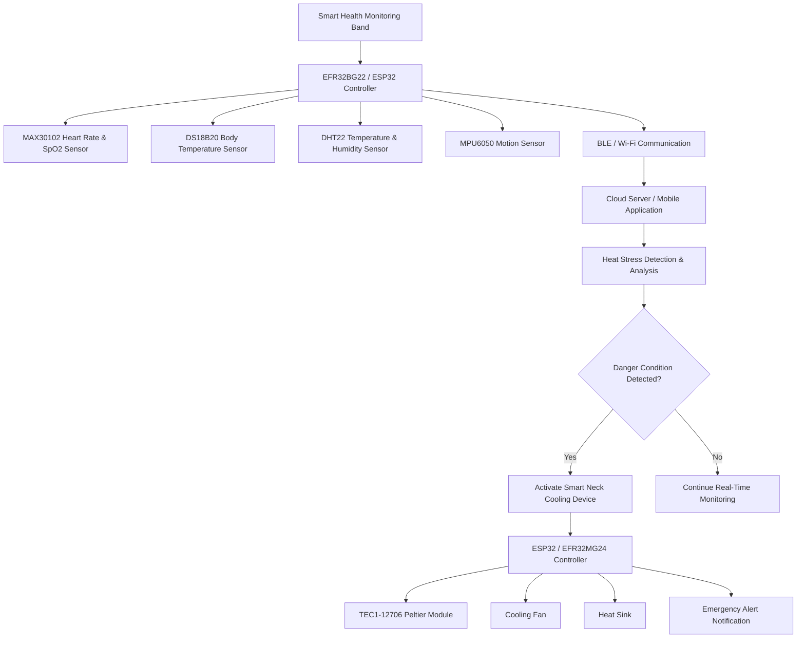

# Centre of Innovation in IoT – Project Description

# 1. Project Overview

## Project Title

# Smart IoT-Based Heatwave Protection System

Heatwaves are becoming one of the most serious environmental and public health challenges across the world, especially in countries with extreme summer temperatures. Outdoor workers such as construction workers, farmers, delivery personnel, traffic police, and industrial laborers are highly vulnerable to dehydration, heat exhaustion, and life-threatening heatstroke due to prolonged exposure to high temperatures. Existing wearable health devices mainly focus on monitoring physiological parameters but do not actively protect the user from heat stress, while portable cooling devices provide cooling without intelligent health analysis.

To address this problem, this project proposes a Smart IoT-Based Heatwave Protection System consisting of two interconnected wearable devices: a Smart Health Monitoring Band and an Intelligent Neck Cooling Gadget. The health monitoring band continuously measures body temperature, heart rate, blood oxygen level (SpO2), activity level, and environmental conditions using embedded sensors. The collected data is processed and transmitted wirelessly using Bluetooth Low Energy (BLE) and Wi-Fi communication.

The system analyzes the health and environmental data in real time to detect signs of heat stress or heatstroke risk. When abnormal conditions are detected, the smart neck cooling gadget automatically activates a thermoelectric cooling system using a TEC1-12706 Peltier module to cool the neck region and help reduce body temperature. The project also supports IoT-based cloud monitoring, emergency alerts, hydration reminders, and future AI-based heatstroke prediction.

The main objective of the project is to create a portable, wearable, and intelligent safety system capable of monitoring health conditions and automatically protecting users from dangerous heatwave conditions.

---

# 2. Technical Architecture

## System Architecture Diagram

---

# 3. Technologies Used

## Wireless Technologies

* Bluetooth Low Energy (BLE)
* Wi-Fi

## Embedded Systems & IoT

* IoT-based Real-Time Monitoring
* Wearable Embedded Systems
* Sensor Fusion
* Thermoelectric Cooling

## Silicon Labs Technologies

* EFR32BG22 Wireless SoC
* EFR32MG24 Wireless SoC
* Gecko SDK (GSDK)
* Silicon Labs BLE Stack

## Programming Languages

* C++
* Embedded C
* Arduino Programming

## Frameworks / SDKs

* Arduino Framework
* ESP32 SDK
* Silicon Labs Gecko SDK

## Development Tools

* Arduino IDE
* Simplicity Studio
* VS Code
* GitHub

## Cloud / IoT Platforms

* Blynk IoT Platform
* Firebase (Future Enhancement)
* ThingSpeak

---

# 4. Hardware Components

# Silicon Labs Hardware

| Component                             | Description                                         |
| ------------------------------------- | --------------------------------------------------- |
| EFR32BG22                             | Low-power BLE communication for wearable smart band |
| EFR32MG24                             | Wireless IoT controller for smart cooling device    |
| Silicon Labs Wireless Development Kit | Development and debugging platform                  |
| Radio Boards                          | BLE and wireless communication testing              |

---

# External Hardware

## Microcontrollers

* ESP32 Development Board (2 Units)

## Sensors

* MAX30102 Pulse Oximeter and Heart Rate Sensor
* DS18B20 Body Temperature Sensor
* DHT22 Temperature and Humidity Sensor
* MPU6050 Accelerometer and Gyroscope Sensor

## Cooling System Components

* TEC1-12706 Thermoelectric Peltier Module
* Aluminum Cooling Plate
* Heat Sink
* Cooling Fan
* Thermal Paste
* MOSFET Driver Module

## Power Management Components

* Li-ion Battery Pack
* 18650 Rechargeable Batteries
* TP4056 Charging Module
* DC-DC Buck Converter

## Display and Alert Components

* OLED Display
* SOS on  Mobile
* Buzzer
* Push Button

## Development and Testing Tools

* Breadboard
* Jumper Wires
* Soldering Kit
* Multimeter
* Oscilloscope / Logic Analyzer

---

# 7. Software Components / Dependencies

# Silicon Labs Dependencies

| Dependency             | Version               |
| ---------------------- | --------------------- |
| Gecko SDK (GSDK)       | Latest Stable Version |
| Simplicity Studio      | Version 5             |
| Silicon Labs BLE Stack | Latest Version        |

---

# External Software Dependencies

## Arduino Libraries

* WiFi.h
* BluetoothSerial.h
* Adafruit_GFX
* Adafruit_SSD1306
* MAX30105 Library
* heartRate.h
* OneWire Library
* DallasTemperature Library
* DHT Sensor Library
* MPU6050 Library

## Development Software

* Arduino IDE
* GitHub
* Blynk IoT Platform

---

# 8. Licensing

This project is released under the MIT License.

Third-party libraries and dependencies used in this project follow their respective open-source licenses.

---

# 9. Maintainers / Contacts

| Name          | Role                              | Contact Information                                         | GitHub Profile                  |
| ------------- | --------------------------------- | ----------------------------------------------------------- | ------------------------------- |
| Devang Shukla | Project Lead & Embedded Developer | [devangshukla218@gmail.com](mailto:devangshukla@example.com) |[https://github.com/devangshukla](https://github.com/Devilwelcometohell) |
| Harsh Sharma | IoT & Cloud Developer | [harsh.sharmaec27@gmail.com](mailto:member2@example.com) | [https://github.com/harshsharma](https://github.com/harshsharmaec27-crypto)|
| Divyanshi Sharma | Hardware & PCB Design| [member3@example.com](mailto:member3@example.com) | https://github.com/member3      |
| Jatin Verma | Software & Cloud Developer | [member3@example.com](mailto:member3@example.com) | https://github.com/member3      |
